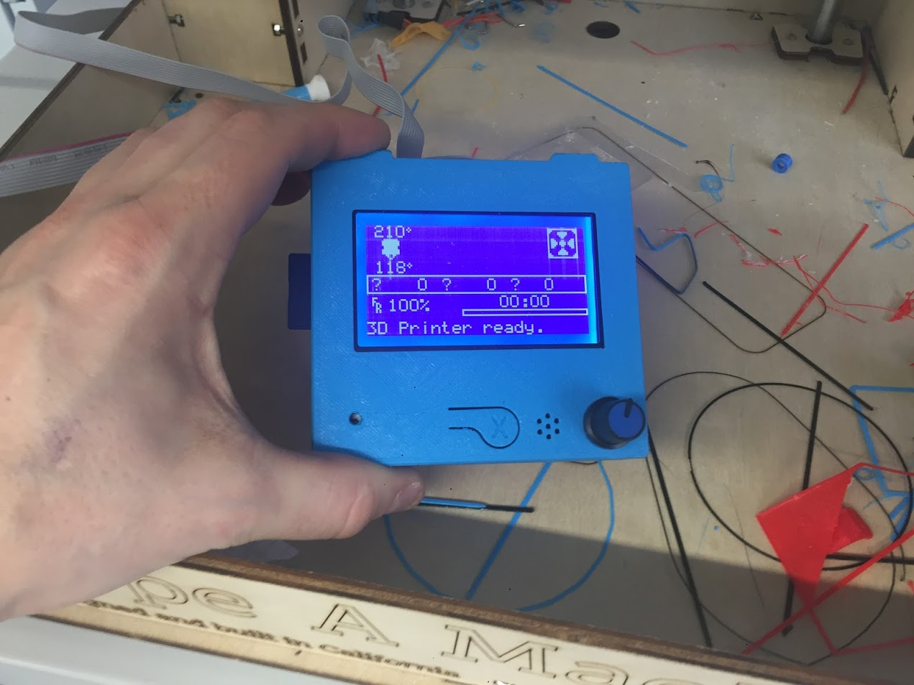
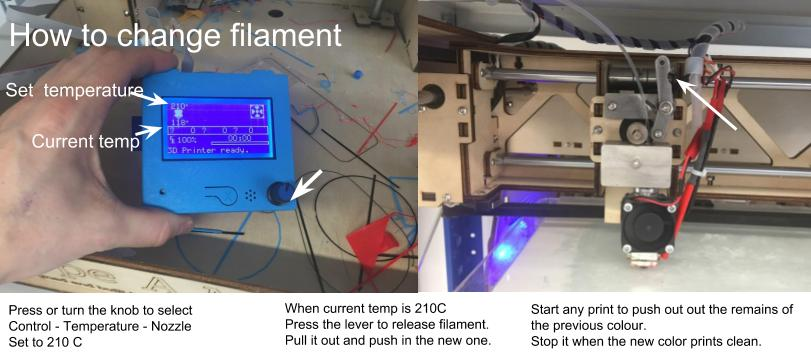

# Type A Machines Series 1 2013 Wood edition with Full Graphic Smart Controller 

Cover design by [Area51](https://www.thingiverse.com/make:455623)

[Checklist for how to print!](how_to_print.pdf)

## Adding the printer to Cura
*  [Download the latest version, install and open Cura](https://ultimaker.com/en/products/ultimaker-cura-software)
* Click here in the top right corner:

* Click "Add printer"
* Choose "Other", select the "Type A Machines Series 1 2014" and accept 
* Click here again

* Click "Manage printers", select "Type A Machines Series 1 2014" and press "Machine settings"
* This menu will pop up, change the  highlighted items according to this image and [paste this code into the "Start Gcode" box](start_g_code.txt)

* Now you are ready to print using SD card on the Type A Machines series 1 2013 wood editon! 
* To switch between printers, click here:

## Using the Smart Controller

You can navigate the menus on the Smart-Controller by turing or pressing the knob on the controller. To activate, turn on the power switch by the power cord and when the printer has powered on, press on the knob to start.

### Printing
[Checklist](how_to_print.pdf)

Use Cura to slice your 3D model.

Recommended generic Cura settings are: 
* 0,2 mm Layer height
* 5% Infill
*Generate support* and *Built plate adhesion* are optional and depends on your design. Check layer view to see how it looks.

(If you choose to use support I recommend that you turn on "Only touching buildplate" support option in the Custom settings menu.)

Load your gcode file onto a SD card and select "Print from SD Card in the menu", find and select your file and it should start.

Typical errors are:
1. Some protruduing parts of the prints, curved parts or angled walls look bad on the bottom side
* Welcome to 3D printing! :) You can try rotating your object in Cura to print in another direction or experiment with the *Generate support* setting in Cura or try adding steeper slopes to your overhangs. Further reading [here](https://rigid.ink/blogs/news/how-to-print-overhangs-bridges-and-exceeding-the-45-rule)
2. The first layer looks smaller than the part
* Your model might not be positioned correctly. Try the *Lay flat* button under the *Rotate* menu in Cura.
3. The model comes loose from the build plate
* Try the *Built plate adhesion* option in Cura or apply fresh thin layer of glue-stick to the build plate. 
4. The first layer looks really off. Stringy or pieces missing
* The build plate might not be perfectly flat and level. Take the glass off, clean the glue of it. Put the glass back and [perform a bed leveling routine](http://reprap.org/wiki/Leveling_the_Print_Bed) before applying fresh glue-stick to the glass.

### Changing Filament
To Change the filament you need to first heat the filament to its melting temperature, for PLA filament this is 210 C.
Find the Nozzle temperature settings in the menues under Control - Temperature - Nozzle 

# Firmware files (only needed if you upgrade/rebuild the printer)
In the marlin directory there is a version of the Marlin 1.1 firmware configurated to run on  Type A Machine Series 1 3D printers from 2013 (plywood frame) equipped with a [DiscountRepRap Full Graphics Smart controller with LCD display and SD card reader](http://reprap.org/wiki/RepRapDiscount_Full_Graphic_Smart_Controller).

This printer type has a RAMPS1.4 card but it is wired a bit different from the standard way so the pins had to be reconfigured to account for things like that the two Y-motors are connected to the connectors marked with Z, among other things. But this is all accounted for in the firmware, just upload it like you would any marlin installation but use these files.

## Pictures from the installation of the Smart Controller

.JPG)
.JPG)

